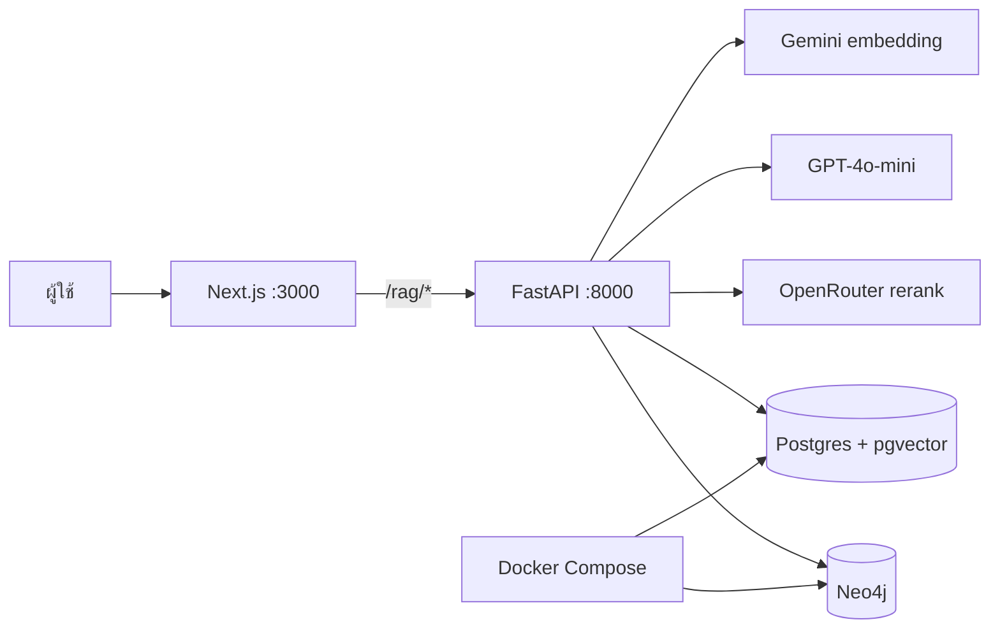
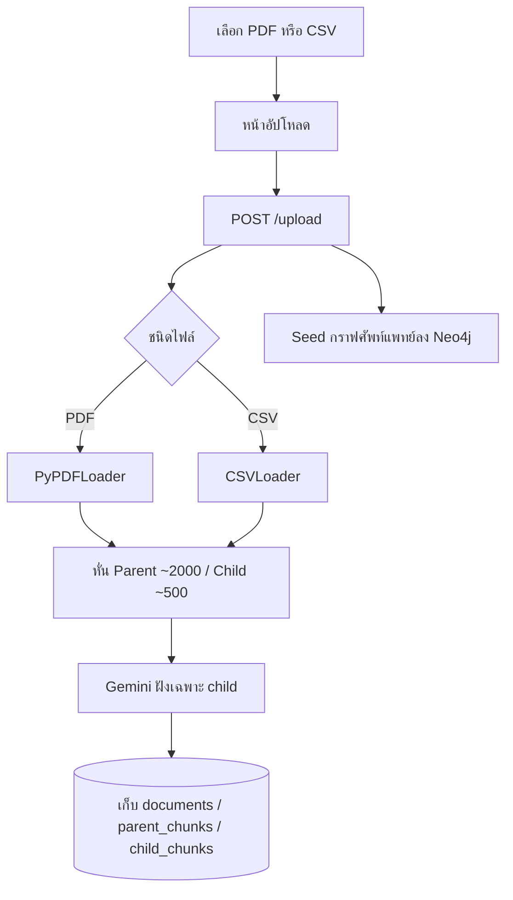
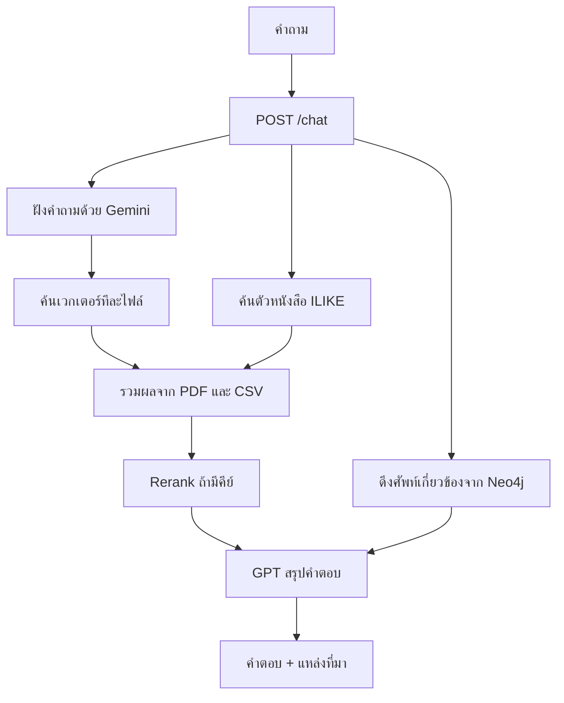
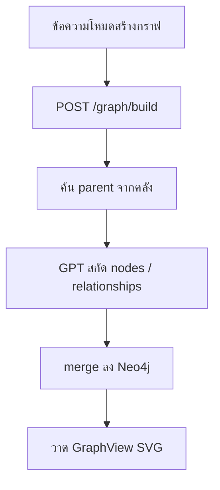

# Medical RAG AI

ระบบถามเอกสารทางการแพทย์แบบ Parent-Child RAG  
อัปโหลด PDF หรือ CSV แล้วถามผ่านแชท ค้นจากคลังเอกสารทั้งหมด และดูกราฟศัพท์ใน Neo4j

- หน้าบ้าน: Next.js ที่ [http://localhost:3000](http://localhost:3000)
- หลังบ้าน: FastAPI ที่ [http://127.0.0.1:8000](http://127.0.0.1:8000)
- ฐานข้อมูล: Postgres + pgvector และ Neo4j ผ่าน Docker

## Flowchart ของระบบ

### ภาพรวม



ผู้ใช้คุยผ่านหน้าบ้านเท่านั้น หลังบ้านเป็นตัวแยกงานไปโมเดลและฐานข้อมูล  
Docker เปิดเฉพาะ Postgres กับ Neo4j ไม่ได้รันเว็บหรือ API

### อัปโหลดเอกสาร



ไฟล์ต้นฉบับถูกอ่านแล้วทิ้ง ระบบเก็บเฉพาะข้อความและเวกเตอร์  
ลบไฟล์ได้จากแทบอัปโหลดหรือ Dataset จะลบ chunk ของไฟล์นั้นออกจาก Postgres

### ตอบแชท



ค้นจากคลังทั้งหมดที่เคยอัปไว้ ไม่จำกัดแค่ไฟล์ล่าสุด  
ถ้า Gemini ฝังคำถามไม่สำเร็จ ระบบยังค้นจากตัวหนังสือในตารางได้

### สร้างกราฟ



กราฟศัพท์แพทย์ชุดเตรียมไว้ถูก seed ตอนอัปโหลด  
โหมดสร้างกราฟเป็นการสกัดเพิ่มจากข้อความและเอกสาร แล้วแสดงในแผงกราฟ

## Tech stack ทั้งหมด

### ภาพรวม

| ชั้น | เทคโนโลยี | เวอร์ชัน / รายละเอียด |
|---|---|---|
| หน้าบ้าน | Next.js, React, TypeScript, Tailwind CSS | Next `16.3.4`, React `19.2.8`, Tailwind `4`, TypeScript `5` |
| เชื่อม UI ↔ API | Next rewrite + Route Handler | หน้าบ้านเรียก `/rag/*` แล้วส่งต่อไป `http://127.0.0.1:8000` |
| หลังบ้าน | FastAPI + Uvicorn + Pydantic | Python 3.11+, CORS เปิดให้ `localhost:3000` |
| Orchestration | LangChain | `langchain-core`, `langchain-community`, `langchain-text-splitters`, `langchain-openai` |
| Embedding | Google Gemini | `google-genai`, โมเดล `gemini-embedding-2`, เวกเตอร์ **3072** มิติ |
| แชท / สกัดกราฟ | OpenAI | `ChatOpenAI`, โมเดลเริ่มต้น `gpt-4o-mini` |
| Rerank | OpenRouter | `nvidia/llama-nemotron-rerank-vl-1b-v2:free` |
| คลังเอกสาร | PostgreSQL + pgvector | ภาพ `pgvector/pgvector:pg16`, ฐาน `vectordb3` |
| กราฟความรู้ | Neo4j | ภาพ `neo4j:5`, Bolt `:7687`, Browser `:7474` |
| Infrastructure | Docker Compose | รันเฉพาะ Postgres และ Neo4j |

หน้าที่โมเดลสั้นๆ: **Gemini ฝังเวกเตอร์**, **OpenRouter จัดอันดับชิ้นที่เกี่ยว**, **GPT ตอบแชทและสกัดกราฟ**

### หน้าบ้าน

- **Next.js 16** App Router ใน `frontend/`
- **React 19** + **TypeScript 5**
- **Tailwind CSS 4** และฟอนต์ **IBM Plex Sans Thai**
- แท็บหลัก: Chat, อัปโหลด, Dataset
- ประวัติแชทเก็บใน `localStorage` ไม่ได้อยู่บนเซิร์ฟเวอร์
- กราฟใน UI วาดด้วย **SVG force layout** ใน `GraphView.tsx` (ลากโหนด / ค้นหา / ดูรายละเอียด)
- หน้าบ้านไม่คุยกับโมเดลตรงๆ ยิงผ่าน `/rag` แล้ว Next rewrite หรือ `frontend/app/rag/[...path]/route.ts` ส่งต่อไป FastAPI
- ตัวเลือก `RAG_API_URL` ใช้เมื่อหลังบ้านไม่ได้อยู่ที่พอร์ต `8000`

### หลังบ้าน

- **FastAPI** ใน `backend/main.py` รันด้วย **Uvicorn**
- โหลด `.env` ผ่าน `python-dotenv` (`components/env.py`)
- API หลัก
  - `POST /upload` อัปโหลด PDF หรือ CSV
  - `POST /chat` ถามเอกสารทั้งคลัง
  - `POST /graph/build` สกัดกราฟด้วย LLM แล้ว merge ลง Neo4j
  - `GET /documents`, `GET /documents/{id}` รายการและเนื้อหา dataset
  - `GET /graph`, `POST /graph/seed` ดูหรือ seed กราฟศัพท์แพทย์
  - `GET /health`, `GET /prompts`

ไลบรารี Python ที่ใช้จริง: `fastapi`, `uvicorn`, `pydantic`, `psycopg2-binary`, `pypdf`, `google-genai`, `langchain-*`, `langchain-openai`, `neo4j`, `requests`

### อัปโหลดและหั่นเอกสาร

1. รับเฉพาะ `.pdf` และ `.csv`
2. ไฟล์ต้นฉบับเซฟชั่วคราวใน `uploads/` แล้วลบทิ้งหลังอ่านเสร็จ
3. PDF อ่านด้วย **PyPDFLoader** (`langchain-community` + `pypdf`)
4. CSV อ่านด้วย **CSVLoader** รองรับ encoding `utf-8-sig`, `utf-8`, `cp874`, `cp1252`
5. หั่นแบบ **Parent-Child** ด้วย `RecursiveCharacterTextSplitter`
   - parent ประมาณ 2000 ตัวอักษร overlap 30 (ใช้เป็น context ตอนตอบ)
   - child ประมาณ 500 ตัวอักษร overlap 20 (ใช้ฝังเวกเตอร์แล้วค้น)
6. CSV หนึ่งแถวมักเป็นหนึ่งชิ้น คอลัมน์ถูกรวมเป็นข้อความ ไม่ได้นับเป็น request แยก
7. หลายไฟล์ถูกสะสมในคลังเดียวกัน ไม่ทับของเก่า ยกเว้นไฟล์ hash เดิม

### Embedding และการค้น

- โมเดล: **Gemini `gemini-embedding-2`**
- เก็บในคอลัมน์ `child_chunks.embeddings vector(3072)`
- ตอนถาม: ฝังคำถามด้วย Gemini แล้วค้นด้วย cosine distance ของ pgvector (`<=>`)
- ค้นแบบผสม
  - เวกเตอร์ทีละไฟล์ เพื่อดึงทั้ง PDF และ CSV
  - ค้นตัวหนังสือ `ILIKE` ใน parent/child เผื่อ embedding เต็มโควต้า
- จัดอันดับชิ้นที่เกี่ยวด้วย **OpenRouter rerank**
- ส่ง parent ที่ได้ไปให้ GPT ตอบ พร้อมบอกชื่อไฟล์ หน้า หรือแถว CSV

แพลนฟรี Gemini embedding ของโปรเจกต์นี้เคยชนลิมิต **100 request/นาที** การอัปไฟล์ใหญ่หรือกดซ้ำจะหมดโควต้าเร็ว

### ตอบแชท

- `langchain_openai.ChatOpenAI` โมเดล `gpt-4o-mini` (เปลี่ยนได้ด้วย `OPENAI_MODEL`)
- context มาจากเอกสารทั้งหมดที่เคยอัปโหลด + ข้อเท็จจริงจาก Neo4j
- prompt อยู่ใน `components/chat_prompt.py`
- ประวัติคุยส่งไปกับคำขอได้ แต่เธรดใน UI เก็บที่เบราว์เซอร์

### กราฟ Neo4j

- Driver ทางการ `neo4j` Python ต่อ `bolt://127.0.0.1:7687`
- กราฟศัพท์แพทย์ที่เตรียมไว้ใน `components/medical_graph.py` ถูก seed ตอนอัปโหลดหรือ `POST /graph/seed`
- โหมดสร้างกราฟ: GPT สกัด JSON `{nodes, relationships}` จากข้อความ + เอกสาร แล้ว `merge_graph`
- ใช้ประกอบคำตอบแชท และวาดในแผงกราฟของหน้าบ้าน

### ฐานข้อมูล

Docker Compose รันสองบริการ

**PostgreSQL 16 + pgvector**

| ตาราง | เก็บอะไร |
|---|---|
| `documents` | ชื่อไฟล์ + `file_hash` |
| `parent_chunks` | ช่วงข้อความยาว, เลขหน้าหรือแถว CSV |
| `child_chunks` | ข้อความสั้น + embedding 3072 มิติ |

**Neo4j 5**

- โหนดศัพท์แพทย์และความสัมพันธ์
- บัญชีตั้งต้น `neo4j` / `newpassword`

### คีย์และ environment

ไฟล์ `.env` ที่รากโปรเจกต์ (คัดลอกจาก `.env.example`)

| ตัวแปร | ใช้ทำอะไร |
|---|---|
| `GOOGLE_API_KEY` | Gemini embedding |
| `OPENAI_API_KEY` | ตอบแชทและสกัดกราฟ |
| `OPENAI_MODEL` | ค่าเริ่มต้น `gpt-4o-mini` |
| `OPENROUTER_API_KEY` | rerank |
| `POSTGRES_*` | ต่อ pgvector |
| `NEO4J_*` | ต่อกราฟ |
| `FRONTEND_ORIGIN` | CORS ของ FastAPI |

อย่า commit `.env`

## สิ่งที่ต้องมีก่อนรัน

- [Docker Desktop](https://www.docker.com/products/docker-desktop/)
- Python 3.11+
- Node.js 20+
- คีย์ API
  - `GOOGLE_API_KEY` สำหรับ Gemini embedding
  - `OPENAI_API_KEY` สำหรับตอบแชทและสร้างกราฟ
  - `OPENROUTER_API_KEY` สำหรับ rerank (ถ้ามี)

## 1) ตั้งค่า environment

คัดลอกตัวอย่างแล้วใส่คีย์ของตัวเอง อย่า commit ไฟล์ `.env`

```bash
cp .env.example .env
```

บน PowerShell:

```powershell
Copy-Item .env.example .env
```

ค่าฐานข้อมูลใน `.env.example` ตรงกับ `docker-compose.yml` อยู่แล้ว

## 2) เปิดฐานข้อมูล

เปิด Docker Desktop แล้วรันที่รากโปรเจกต์

```bash
docker compose up -d
```

บริการที่ขึ้น:

| บริการ | พอร์ต | บัญชีตั้งต้น |
|---|---|---|
| Postgres + pgvector | `5432` | `postgres` / `newpassword` ฐาน `vectordb3` |
| Neo4j | `7474` (เบราว์เซอร์), `7687` (Bolt) | `neo4j` / `newpassword` |

ตรวจว่าคอนเทนเนอร์ทำงาน:

```bash
docker compose ps
```

## 3) รันหลังบ้าน (FastAPI)

ที่รากโปรเจกต์:

```powershell
python -m venv .venv
.\.venv\Scripts\Activate.ps1
pip install -r requirements.txt
```

รัน API จากโฟลเดอร์ `backend` หลัง activate venv แล้ว:

```powershell
cd backend
python -m uvicorn main:app --reload --port 8000 --host 127.0.0.1
```

หรือรันจากรากโปรเจกต์โดยไม่ต้องเข้า `backend`:

```powershell
.\.venv\Scripts\python.exe -m uvicorn backend.main:app --reload --port 8000 --host 127.0.0.1
```

ตรวจว่าหลังบ้านขึ้นแล้ว: [http://127.0.0.1:8000/health](http://127.0.0.1:8000/health)

อย่ารันคำสั่ง `.\.venv\Scripts\python.exe` ตอนอยู่ในโฟลเดอร์ `backend` เพราะ venv อยู่ที่รากโปรเจกต์

## 4) รันหน้าบ้าน (Next.js)

เปิดเทอร์มินัลอีกอัน:

```powershell
cd frontend
npm install
npm run dev
```

เปิด [http://localhost:3000](http://localhost:3000)

หน้าบ้านยิง API ผ่าน `/rag/*` แล้ว rewrite ไปที่ `http://127.0.0.1:8000`  
ถ้าหลังบ้านอยู่คนละเครื่องหรือคนละพอร์ต ตั้ง `RAG_API_URL` ใน `frontend/.env.local`

## ลำดับที่แนะนำตอนเปิดเครื่องใหม่

1. เปิด Docker Desktop
2. `docker compose up -d`
3. รันหลังบ้านที่พอร์ต `8000`
4. รันหน้าบ้านที่พอร์ต `3000`
5. เปิดเว็บที่ `http://localhost:3000`

## วิธีใช้คร่าวๆ

1. แทบ **อัปโหลด** ใส่ไฟล์ PDF หรือ CSV
2. แทบ **Dataset** ดูสรุปคลังที่ index แล้ว
3. แทบ **Chat** ถามจากเอกสารทั้งหมดที่เคยอัป
4. ปุ่มกราฟเปิดแผง Neo4j หรือใช้โหมดสร้างกราฟจากข้อความ

ไฟล์ต้นฉบับถูกอ่านแล้วทิ้ง ระบบเก็บเฉพาะช่วงข้อความและเวกเตอร์ใน Postgres

## โครงสร้างหลัก

```text
backend/main.py              API FastAPI
frontend/                    UI Next.js
components/database.py       อัปโหลด ค้นหา ตอบแชท
components/chunking_process.py  หั่น PDF / CSV แบบ parent-child
components/gemini_embedding.py  ฝังเวกเตอร์ด้วย Gemini
components/graph.py          Neo4j
docker-compose.yml           Postgres และ Neo4j
```

## ปัญหาที่พบบ่อย

**หน้าบ้านเรียก API ไม่ได้**  
ตรวจว่าหลังบ้านเปิดที่พอร์ต `8000` และหน้าบ้านเปิดที่ `3000`

**Connection refused ที่ Postgres / Neo4j**  
Docker Desktop ยังไม่เปิด หรือยังไม่ได้รัน `docker compose up -d`

**อัปโหลดขึ้น 429 จาก Gemini**  
โควต้า embedding ฟรีเต็ม รอประมาณ 1 นาทีแล้วอัปใหม่ครั้งเดียว อย่ากดรัว

**รัน uvicorn แล้วหาโมดูลไม่เจอ**  
activate `.venv` ที่รากโปรเจกต์ก่อน แล้วค่อยเข้า `backend`

**อัปไฟล์ซ้ำแล้วไม่เห็นของใหม่**  
ไฟล์เดิม hash เดียวกันจะไม่ index ซ้ำ ถามแชทได้จากทุกไฟล์ที่เข้าคลังแล้ว
